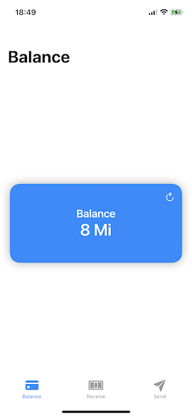
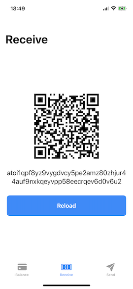
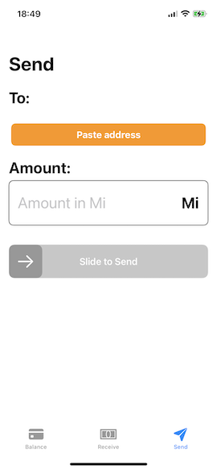

# IOTA Wallet for iOS

The IOTA Wallet is a WiP App, use it at your own risk.

## Install

Just open the Xcode Project, wait for SPM and run :)

## Features

- Add account
- Generate mnemonic
- Use your own mnemonic
- Generate new address (receive)
- Send transaction (send)

## Author

IOTA Wallet is maintained by [Pascal Ambrosini](https://pascalbros.github.io)

You can follow me on Twitter at [@PascalAmbro](http://twitter.com/PascalAmbro).

## License
IOTA Wallet is licensed under the terms of the MIT License. Please see the LICENSE file for full details.